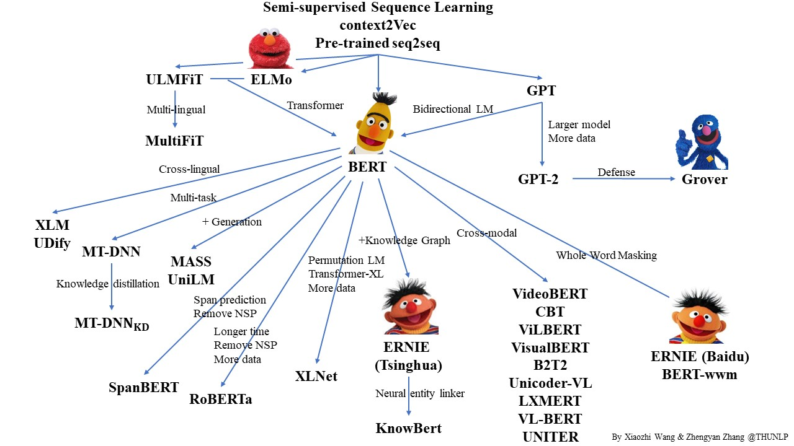

# 文本表示的方法
下面对文本表示进行一个归纳，也就是对于一篇文本可以如何用数学语言表示呢？
- 基于one-hot、朴素贝叶斯、tf-idf、text rank等的bag-of-words；
	1. 词袋（bag of words）模型：采用词袋模型（即计算文章中各个单词出现的次数）来建立特征输入机器学习分类器。
	1. 关键词提取方法：tf-idf、text rank
- 主题模型：LSA（SVD）、pLSA、LDA；
- 基于词向量的固定表征：word2vec、fastText、glove；
- 基于词向量的动态表征：ELMo、GPT、Transformer、Bert、XLNet、ALBERT；

# 语言模型发展历史
第一代：N-gram(马尔科夫链，统计学)--->第二代：BOW/LDA(统计学语言模型)--->第三代：word2vec(CBOW/Skip-gram，浅层神经网络)--->第四代：ELMo、GPT、Bert(深度学习时代)

# 预训练语言模型的前世今生

1. [[CLS]预训练语言模型的前世今生[SEP]萌芽时代[SEP]](https://mp.weixin.qq.com/s/1ixYjJN-bJPGrr7v-4d7Rw)
1. [[预训练语言模型的前世今生] 风起云涌](https://mp.weixin.qq.com/s/g4jEVU3BkRem-DYXCn5eFQ) 
1. [12个NLP预训练模型的学习笔记](https://mp.weixin.qq.com/s/IndeECchmX_GC8MzuWSVfg)

# NLP经典论文
1. A neural probabilistic language model    
Yoshua Bengio · Rejean Ducharme · Pascal Vincent · Christian Janvin    
2003 · Journal of Machine Learning Research | 被引数：3297     

1. Natural Language Processing (Almost) from Scratch   
Ronan Collobert · Jason Weston · Leon Bottou · Michael Karlen · Koray Kavukcuoglu · Pavel P Kuksa   
2011 · Journal of Machine Learning Research | 被引数：3384     

1. Attention Is All You Need       
ELMo等基于深度学习的方法可以有效地学习出上下文有关词向量，但毕竟是基于LSTM的序列模型，即便结合使用注意力机制，必然也要面临梯度以及无法并行化的问题。在本文中，我们重点来讲解Transformer模型，它的核心是Self-Attention机制，并且Transformer也是BERT的核心组成部分。

1. 从Transformer到BERT模型        
在18年年底的时候，有一件事情轰动了整个NLP界，它就是大家所熟悉的BERT模型，它刷新了整个文本领域的排行榜，受到了全球的瞩目。之后，很多公司慢慢开始采用BERT作为各种应用场景的预训练模型来提高准确率。在本文里，我们重点来讲解BERT模型以及它的内部机制。
